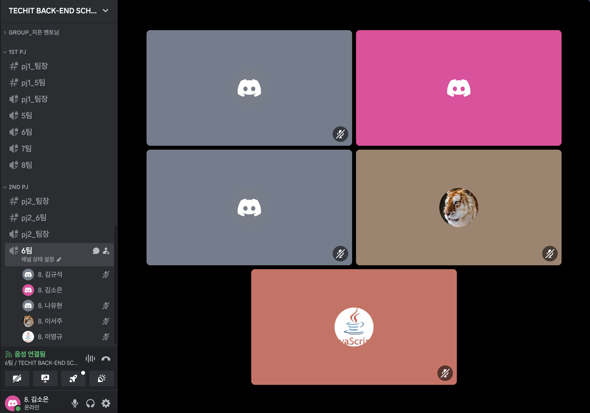
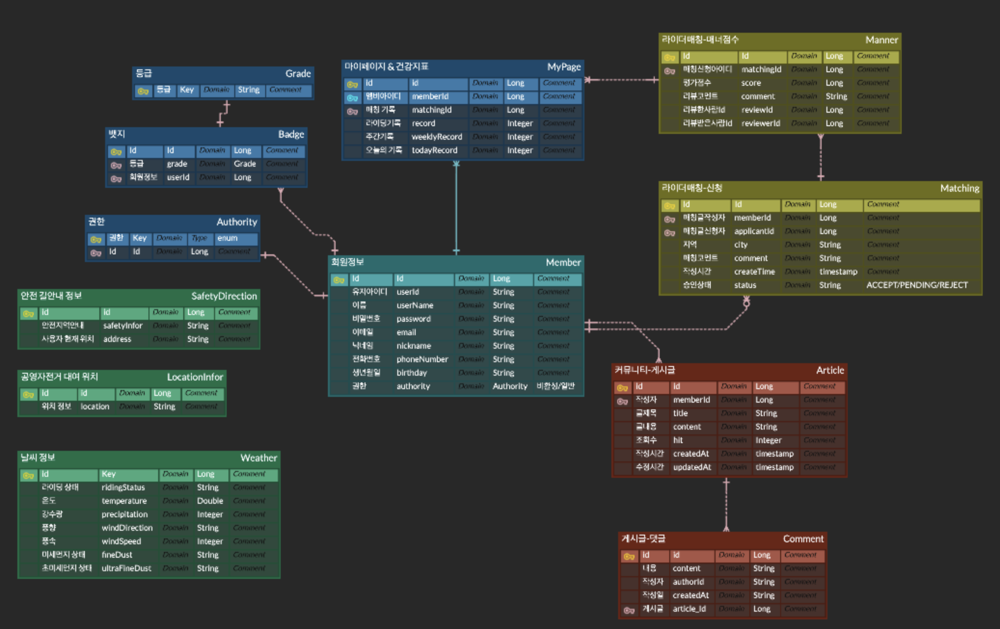
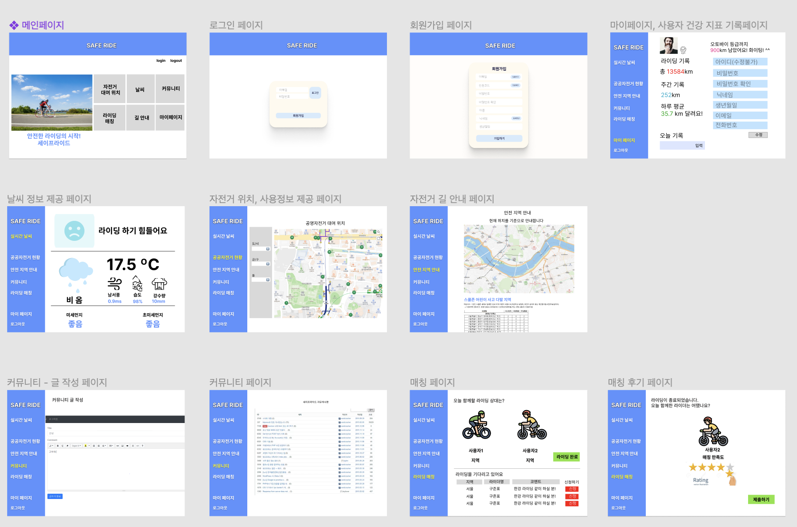

# [1주차] Project_6팀 진행상황 공유

## 팀 구성원, 개인 별 역할

---

**김소은(팀장)**: 기획, 안전한 자전거 길 안내 기능 구현

**이서주(팀원)**:기획, 지역별 공영 자전거 사용 정보 안내 기능 구현

**나유현(팀원)**: 기획, 사용자 건강 지표 기록 기능 구현

**박주윤(팀원)**: 기획, 자전거 이용자 커뮤니티 구현

**이영규(팀원)**: 기획, 로그인 페이지, 마이페이지 구현

**김규석(팀원)**: 기획, 날씨 정보 안내 기능 구현

## 팀 내부 회의 진행 회차 및 일자

---

1회차(2024.04.11) 디스코드 음성,채팅 진행

2회차(2024.04.12) 디스코드 음성,채팅 진행

## 현재까지 개발 과정 요약 (최소 500자 이상)

---

**김소은** 
- 기능별 목표: 네이버 지도 가져오기, 공공 오픈 API 받아오는 받아오기 
- 목표 달성률: 40% - 공공 오픈 API 받아오는 방법 알아보는 단계 
- 기능은 공공 데이터 오픈 API의 사고 다발 지역의 데이터를 가지고와 네이버 맵 API에 나타내기 
  현재 네이버 지도 가져오는 방법은 완료 단계이며, 오픈 API를 가져오는 방법에 대해서 공부 중

    
**이서주**
- 기능별 목표 : 공영데이터 자전거 운영현황 데이터를 API로 받아와 json으로 파싱하여 view에서 확인
- 목표 달성률 : 60% 
- 자지 단체 공영자전거 운영 현황 데이터를 Open Api로 받아오기 위해 공공데이터 활용 신청을 했으며, 제공된 url을 통해 http 데이터를 받아오고 json으로 파싱되는 것을 확인함. 
  GET 방식으로 API를 받아오는데, 3종류의 api가 있고 각각은 request 내용이 거의 동일하나 api주소 및 기능별로 몇가지 추가되거나 변경되는 정보가 있어 코드의 중복을 막고 유지보수성을 높이기위해 메서드를 세분화하는 방향으로 리팩토링 중이며, 이후 추가로 2가지 api에 대한 정보를 더 받아올 예정임.

**나유현**
- 자전거 이용 기록 페이지 구현 
- 목표 달성률: 20%
- 카카오 map에 사용자 현재 위치 표시 완료
  백엔드 구현 설계 중 -> 출발지, 도착지를 지정으로 할 지, 위치 이용해서 실제 이동 거리로 할 지

**박주윤**

- 커뮤니티 게시판, 매칭 기능 구현
- 목표 달성률: 20%
- 1. 게시글 생성할 때 광역자치구와 그에 해당하는 도시를 선택하여 게시글을 생성하는 기능 구현
  2. 게시글 상세 조회, 전체 조회 기능 구현 
  3. 게시글 생성하면 현재 시간을 바탕으로 생성 시간 데이터 베이스 저장 완료
  4. 현재 프론트 부분은 아직 신경 쓰지않고 기능만 구현 중

**이영규**

- 로그인 페이지 구현 
  - 목표달성률: 30% 
  - spring security form login을 프로젝트에 적용
  - spring security로 로그인 시 권한 확인이 필수적임. authority 컬럼 추가  

    - 회원가입 
      - DB에 내용 저장이 되도록 기능 작성
      - 예외처리 / 페이지 이동 문제 등, 다른 필수 조건들은 추후 작성 예정
    
    - 로그인
      - session이 생성, 인증을 요구하는 페이지 접근이 가능하도록 기능 작성
      - 성공 / 실패 시 페이지 이동 문제, 예외처리 등, 다른 필수 조건들은 추후 작성 예정

    - 로그아웃 시 기능 작성 완료
      - 버튼 클릭 시 브라우저 session 삭제

- 마이페이지 구현 
    - 목표달성률: 10%
     - 접속테스트
     - 권한이 필요한 빈 페이지를 만들어만 놓고, 접속가능여부만 확인
  

**김규석**

- 기능별 목표: 날씨 페이지 
- 목표달성률: 10% - 기능 구상 단계 
- 날씨 안내 기능 구현을 위해 기상청 API허브 이용방법 연구중

## 개발 과정에서 나왔던 질문 (최소 200자 이상)

--- 

- 안전한 자전거 길 사용자 위치 조회 페이지의 매핑이 GET인가 POST인지? 
  - 조회라는 것은 데이터를 받아 오는 것이다 보니 POST일 수 있겠지만, http에서 정보를 받는 것이 아니라면 GET을 사용하는게 좋다.
- MySQL 사용 방법
  - 개발 초기 단계에서는 SQLite로 사용하고, 고도화 단계에서 MySQL로 변경
- commit message 사용
  - commit message를 노션에 정리 feat(새로운 기능 추가), fix(버그 수정)...

## 개발 결과물 공유

---

GitHub Repository URL: [https://github.com/soeunc/safe_ride](https://github.com/soeunc/safe_ride)

- ERD

- 화면 기획
