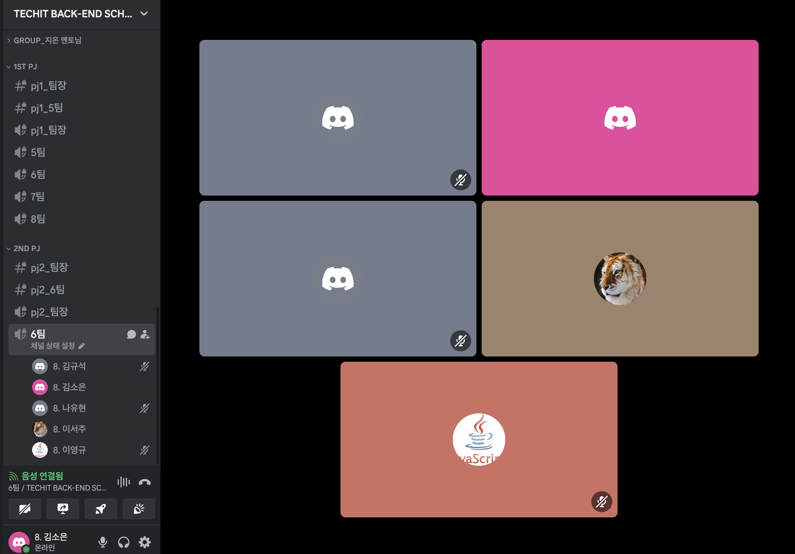

# [2주차] Project_6팀 진행상황 공유

## 팀 구성원, 개인 별 역할

---

**김소은(팀장)**: 기획, 안전한 자전거 길 안내 기능 구현

**이서주(팀원)**:기획, 지역별 공영 자전거 사용 정보 안내 기능 구현

**나유현(팀원)**: 기획, 사용자 건강 지표 기록 기능 구현

**박주윤(팀원)**: 기획, 자전거 이용자 커뮤니티 구현

**이영규(팀원)**: 기획, 로그인 페이지, 마이페이지 구현

**김규석(팀원)**: 기획, 날씨 정보 안내 기능 구현

## 팀 내부 회의 진행 회차 및 일자

---

3회차(2024.04.15) 디스코드 음성,채팅 진행

4회차(2024.04.16) 디스코드 음성,채팅 진행

5회차(2024.04.17) 아이디어톤 (김규석님 결석, 박주윤님 14:13 조퇴)

6회차(2024.04.18) 디스코드 음성,채팅 진행 (김규석님 결석)

7회차(2024.04.19) 디스코드 음성,채팅 진행 (김규석님 결석)

## 현재까지 개발 과정 요약 (최소 500자 이상)

---

**김소은** 
1. 기능별 목표: 사용자 위치로 지도 이동
- 목표 달성률: 100%
  - 사용자가 입력한 주소(지번,도로명)를 입력 받아 사용자의 좌표로 지도 이동 완료
2. 사고다발지역 API 가져오기
  - 목표 달성률: 100%
    - 사고 다발자역 API를 가져올 때 전체 데이터를 얻기 위한 URL을 한번 호출 후 API 호출
3. 사용자 위치 주변 사고 다발 위치 확인
- 목표 달성률: 80%
  - 필터링된 법정동 코드를 기반으로 일치하면 사고 좌표를 가져오도록 구현 완료
  - 사고 년도 수를 지정해서 데이터를 가져오다 보니까 사고가 데이터의 갯수가 적어서 전체 년도를 가져오도록 구현 예정
4. 지도에 사고 죄표 표시
- 목표 달성률: 70%
  - 사용자의 위치를 입력받아 필터링된 법정동 코드가 일치한 데이터에서 사고 좌표를 가져와 지도 마커 표시 완료
  - 마커를 클릭시 사고 정보가 나오게 구현 예정

**이서주**
1. 기능별 목표 : 도로명주소 팝업 API 적용
- 목표 달성률 : 100%
  - 조회 페이지에서 버튼을 클릭하면 검색 팝업창이 생성되고 검색 가능
  - 검색 결과를 호출하여 건물번호를 제외한 도로명주소 추출
2. 대여소 정보 API를 도로명 주소로 탐색
- 목표 달성률 : 80%
  - 대여소에 대한 전체 데이터 로딩
  - 전체 데이터에서 검색한 도로명주소와 일치할 때 대여소 데이터를 반환하도록 필터링
  - 반환하며 Map에 대여소 아이디 값을 저장
  - 반환값을 뷰에서 확인
  - 테이블의 대여소 정보 클릭 시 상세 info가 나타나도록 구현 예정
3. 자전거 현황 API를 필터링된 대여소의 아이디로 탐색
- 목표 달성률 : 100%
  - 2의 작업이 완료되면 아래의 작업 수행
  - 자전거 현황에 대한 전체 데이터 로딩
  - 전체 데이터 중 2에서 Map에 저장한 대여소 아이디 값과 일치하는 데이터를 반환하도록 필터링
  - 반환값을 뷰에서 확인
4. 지도에 자전거 대여소 위치+사용가능 자전거 대수 표시, 상세주소 표시
- 목표 달성률 : 60%
  - 지도 위에 대여소 위치 마커와 함께 사용가능한 자전거 대수 표시
  - 마커 클릭 시 상세주소를 표시하도록 구현 예정
5. 공통 템플릿 적용
- 목표 달성률 : 40%
  - 테스트 템플릿 적용 완료
  - 테스트 템플릿 배포 전
  - 템플릿 개선 요구사항 도출 필요
  - 메인페이지 제작 예정

**나유현**
1. 키워드로 도착지 검색
- 목표 달성률 : 100%
  - 키워드로 도착지 검색 시 관련 목록 제공
  - 지도 상에 마커 표시
2. 주행 거리 제공
- 목표 달성률 : 50%
  - 사용자의 현재 위치 표시
  - 주행한 거리 누적하여 표시
  - 노트북으로 테스트 시 geolocation api 명세처럼 동작하지 않는 문제 발견 -> 휴대폰으로 테스트 필요 -> 휴대폰으로 테스트 할 경우 geolocaion api가 https 에서만 동작하기 때문에 배포 필요 -> 개인적으로 배포하여 테스트할 예정

**박주윤**

- 업데이트 예정

**이영규**

1. 로그인 페이지 구현 / 목표달성률: 70%
- 회원가입
  - 회원가입 시 '등급'뱃지 생성(킥보드 등급)
  - 정상 회원가입 시 alert창으로 회원가입 확인 메시지 추가
  - 빈 입력란이 있으면 회원가입 비활성화
  - id 등 특정 입력란 중복확인 기능 추가 예정

2. 마이페이지 구현 / 목표달성률: 60%
- 오늘 기록 입력 추가
  - 오늘의 라이딩 기록 입력 시 DB 저장
- 라이딩기록 추가
  - 전체 / 주간 / 오늘 기록을 화면에 나타낸다.
  - 전체 / 주간기록의 경우 특정 member id의 기간 합산으로 가져옴
- 주간 라이딩 기록 그래프 추가
  - 일요일 ~ 토요일 간 데이터를 그래프로 보여줌
- 뱃지 추가
  - 회원가입 시 생성되는 '등급' 뱃지를 마이페이지에 나타냄
  - 킥보드 / 자전거 / 스쿠터 / 오토바이 등급
  - 등급 기준 달성 시 자동 등급 변경 기능 추가 예정
  

**김규석**

1. 날씨 정보
- 목표 달성률 20%
  - 공공데이터포털에서 기상청이 제공하는 기상청 단기예보 ((구)동네예보) 조회서비스OpenAPI를 이용해 날씨데이터를 가져올 예정
  - 오픈 API 활용 방법에 대해서 공부중

2. 미세먼지 정보
- 목표 달성률 20%
  - 공공데이터포털에서 한국환경공단이 제공하는 한국환경공단 에어코리아 대기오염정보 OpenAPI를 이용해  미세먼지 및 초미세먼지 정보를 가져올 예정
  - 오픈 API 활용 방법에 대해서 공부중
  - 개발과정중 컨디션 난조로 진행이 중단. 다시 빠르게 진행할 예정

## 개발 과정에서 나왔던 질문 (최소 200자 이상)

--- 

- 테스트 코드를 작성할 것인지
  - 기능 구현을 우선 적으로 진행
- Manner entity의 matchingArticled는 본인의 memberId가 들어가는걸까요?
  - optional = true로 설정하고 manner가 없으면 null처리되게끔한담에 front 단에서 null일때 매칭기록 없다고 표시하는 방법
- MyPage 엔티티는 라이딩 기록 데이터가 매일 새롭게 생성되며, 한 명이 여러 개의 데이터를 가져가는 게 맞을까요?
  - 오늘 라이딩 기록과 별개로 기록 날짜 속성을 추가해서 사용자가 여러개 라이딩 기록을 가져야 할 것 같다.

## 개발 결과물 공유

---

GitHub Repository URL: [https://github.com/soeunc/safe_ride](https://github.com/soeunc/safe_ride)
