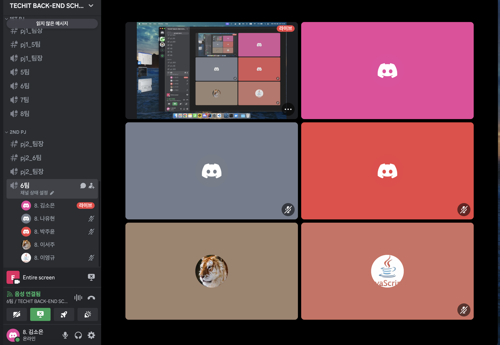

# [3주차] Project_6팀 진행상황 공유

## 팀 구성원, 개인 별 역할

---

**김소은(팀장)**: 기획, 안전한 자전거 길 안내 기능 구현

**이서주(팀원)**:기획, 지역별 공영 자전거 사용 정보 안내 기능 구현

**나유현(팀원)**: 기획, 사용자 건강 지표 기록 기능 구현

**박주윤(팀원)**: 기획, 자전거 이용자 커뮤니티 구현

**이영규(팀원)**: 기획, 로그인 페이지, 마이페이지 구현

**김규석(팀원)**: 기획, 날씨 정보 안내 기능 구현

## 팀 내부 회의 진행 회차 및 일자

---

8회차(2024.04.22) 디스코드 음성,채팅 진행

9회차(2024.04.23) 디스코드 음성,채팅 진행

10회차(2024.04.24) 디스코드 음성,채팅 진행

11회차(2024.04.25) 디스코드 음성,채팅 진행 (나유현님 14:13 조퇴)

12회차(2024.04.26) 디스코드 음성,채팅 진행 (박주윤님 13:40 지각, 김규석님 결석)

## 현재까지 개발 과정 요약 (최소 500자 이상)

---

**김소은**
1. 사용자 위치 주변 사고 다발 위치 확인
- 목표 달성률: 100%
  - 필터링된 법정동 코드를 기반으로 일치하면 사고 좌표를 가져오도록 구현 완료
  - 사고 년도 수는 데이터에 존재하는 최신 데이터를 가져옴
2. 지도에 사고 죄표 표시
- 목표 달성률: 100%
  - 사용자의 위치를 입력받아 필터링된 법정동 코드가 일치한 데이터에서 사고 좌표를 가져와 지도 마커 표시 완료
  - 마커에 마우스 가져다댔을 때 사고 정보(사고위치, 발생건수, 사망자수) 나오게 구현 완료
  - 로딩되는 모습을 사용자에게 보여주기 위한 스피너 추가 구현 완료
3. 스쿨존 사고다발지역 데이터 추출
- 목표 달성률: 100%
  - 데이터 추출 방식을 자전거 사고다발지역과 같음
4. 스쿨존 지도 좌표 표시
- 목표 달성률: 100%
  - 자전거 사고다발지역 좌표와 다름을 표시하기 위해 커스텀 마커로 이미지로 마커 사용
  - 마커에 마우스 가져다댔을 때 사고 정보 표시 완료
5. 폼 수정
- 목표 달성률: 80%
  - 안전한 자전거 길 안내 폼 정리 및 수정
  - 로딩 스피너 추가하여 로딩하는 순간을 사용자에게 알려줌
  - 기존 네비바의 사용자 이미지와 사용자 이름 수정
    - 이미지 삭제
    - 로그인한 사용자의 이름이 보이게 변경
6. 데이터베이스 변경(MySQL)
- 목표 달성률: 50%
  - RDS로는 완료
  - Docker 사용하는 것으로 변경 중

**이서주**
1. 대여소 정보 API를 도로명 주소로 탐색
- 목표 달성률 : 100%
  - 전체 데이터에 반경 2km 내에 있을 때 해당하는 대여소 표기 완료
  - 결과 테이블을 페이지네이션하여 뷰에서 확인 가능
2. 지도에 자전거 대여소 위치+사용가능 자전거 대수 표시, 상세주소 표시
- 목표 달성률 : 60%
  - 전체 데이터에 반경 2km 내에 있을 때 해당하는 대여소 대여터 표기 완료
  - 결과 테이블을 페이지네이션하여 뷰에서 확인 능
  - 지도 위에 대여소 위치 마커와 함께 사용가능한 자전거 대수 표시
  - 마커 클릭 시 상세주소를 표시하도록 구현 예정
3. 현재 위치 기준 검색
- 목표 달성률 : 100%
  - 사용자의 현재 위치를 받아 좌표로 변환
  - 좌표 기준 2km 이내 지역의 대여소 정보 수집 및 표기 완료
4. 공통 템플릿 적용
- 목표 달성률 : 80%
  - 메인페이지 제작 중

**나유현**
1. 사용자 건강 지표 기록 페이지 구현 / 목표달성률: 90%
- 자전거 이용 기록
  - 주행 거리 오류 수정
  - 사용자 마커 수정
  - 테스트 진행 예정

**박주윤**
1. 커뮤니티 - 게시글 / 목표달성률: 90% (수정 단계)
 - 대부분 기능 및 프론트 구현 완료
 - 테스트 하면서 추가할 기능 있는지 확인
2. 커뮤니티 매칭 / 목표달성률: 80% (수정 단계)
 - 매칭글, 매칭 신청 부분 기능 대부분 구현 완료
 - 매칭글 프론트 부분 구현 중(80% 구현 )
 - 매칭 종료 후 매너 점수 평가 기능 구현 완료(프론트 수정 중)

**이영규**
1. 로그인 페이지 구현 / 목표달성률: 100% 
- 회원가입
  - 정규식 추가
  - 실패/성공 시 alert창으로 결과 보여주기 추가
  - 특정 입력창들에 대한 중복체크 추가(ajax활용)
  - 패스워드 중복체크 추가
- 로그인
  - 실패/성공 시 alert창으로 결과 보여주기 추가
2. 마이페이지 구현 / 목표달성률: 60%
- 정보 수정 정규식 추가
- 특정 입력창들에 대한 중복체크 추가(ajax활용)
- 패스워드 중복체크 추가
- 마이페이지 오늘의기록 1000000m(1000km) 초과 불가하도록 변경
- 마이페이지 기록을 km소수점 세자리로 나타내도록 변경
- 전체 / 주단위 / 오늘의 기록 각종 버그 fix
- 정보 수정 - ajax도입으로 나타난 각종 버그 fix

**김규석**

## 개발 과정에서 나왔던 질문 (최소 200자 이상)

--- 

* html에서의 이미지 파일 경로 질문
  * 이미지 파일 경로를 html으로 설정해서 content로 보내주면 이미지 파일 로드 가능
* 매칭 기록을 마이페이지에 놓는게 좋을지?
  * 애매한 부분이 있어서 일단 보류
* 거리 측정을 한 기록에 대해서 마이페이지의 오늘의 기록에 저장 시키면 될지 고민
  * 사용자 입장에서는 기록이 자동으로 저장이 되는 것을 생각할 꺼 같다는 의견으로 일단 오늘의 기록에 저장하는 것으로 함.
* DB교체 작업 중 에러 발생 애플리케이션에서 데이터베이스를 연결하는 와중에 발생한 것으로 보임
  * 데이터베이스를 연결하는 작업에서 기존에 url만 전달하고 있어가지고 이름과 비밀번호를 같이 전달
* DB교체 작업에서 팀원 공유 작업을 어떻게 하는지
  * 로컬에서 도터를 사용해서 하는 방법으로 사용 중이었는데 ec2를 사용하는 것으로 변경 중

## 개발 결과물 공유

---

GitHub Repository URL: [https://github.com/soeunc/safe_ride](https://github.com/soeunc/safe_ride)
